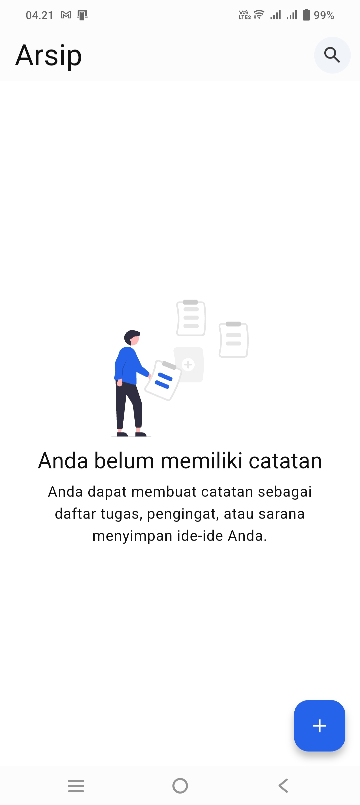
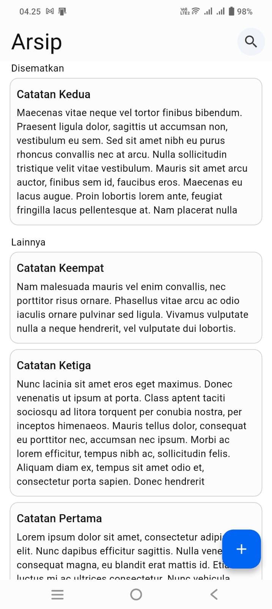
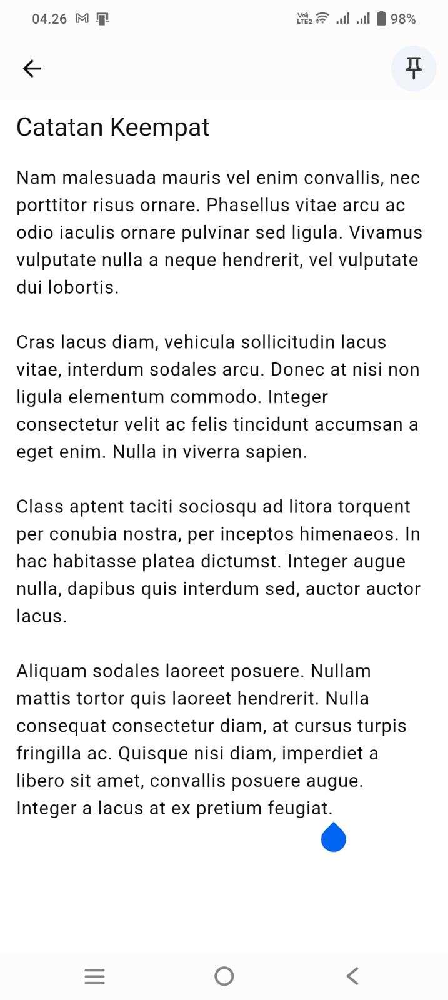
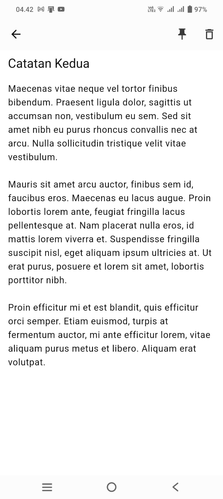
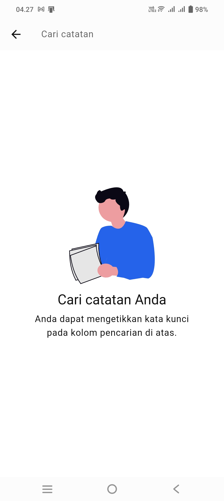
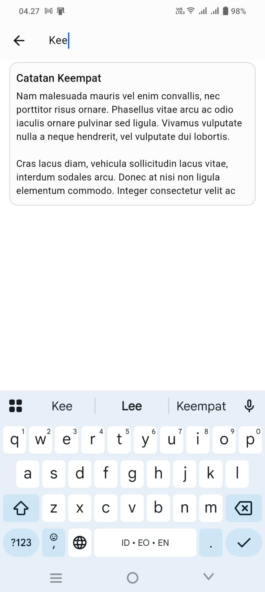

  

# Arsip

Catatanku adalah aplikasi Android yang memungkinkan pengguna untuk mencatat sebuah catatan. Catatan yang dapat dibuat dapat berupa daftar tugas, pengingat, penyimpanan ide-ide, dll.

## Fitur-Fitur

Berikut merupakan fitur-fitur yang tersedia di Catatanku:

- Membuat catatan baru
- Edit catatan yang telah dibuat
- Hapus catatan yang telah dibuat
- Menampilkan catatan berdasarkan apakah telah disematkan
- Mencari catatan berdasarkan judul atau isi catatan
- Lokalisasi bahasa Indonesia dan Inggris
- Tersedia light dan dark theme

## Screenshot

|| |

|| |

|| |